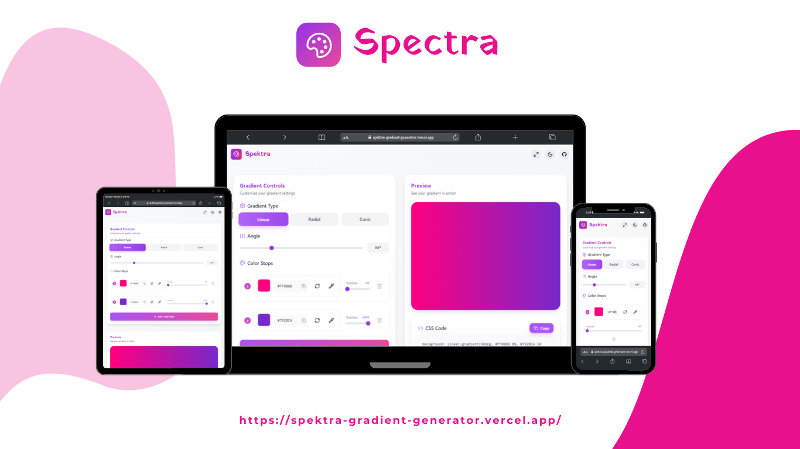

# Spektra Gradient Generator 🎨

<p align="center">
  
</p>

[](https://opensource.org/licenses/MIT)
[](http://makeapullrequest.com)

A modern, powerful, and intuitive gradient generator built with React and TypeScript. Create beautiful CSS gradients with ease across any device.

<p align="center">
  
</p>

## 🌟 Featured On
<p align="center">
  <a href="https://www.producthunt.com/posts/spektra?embed=true&utm_source=badge-featured&utm_medium=badge&utm_souce=badge-spektra" target="_blank">
    
  </a>
</p>

## ✨ Features

### 📱 Responsive Design
- Fully adaptive layout for all screen sizes
- Mobile-first approach
- Touch-friendly interface
- Optimized for tablets and smartphones

### 🎨 Gradient Types
- Linear gradients
- Radial gradients
- Conic gradients

### 🎯 Advanced Controls
- 360° angle adjustment
- Customizable center position
- Unlimited color stops
- Percentage-based color positioning

### 🔧 Technical Features
- One-click CSS code export
- Real-time preview
- Dark/Light theme support
- Local storage for preferences
- Screen color picker tool

## 🚀 Getting Started

### Prerequisites
- Node.js
- npm

### Installation
```bash
# Clone the repository
git clone https://github.com/elmorjanimohamed9/Spektra.git

# Navigate to project directory
cd spektra

# Install dependencies
npm install

# Start development server
npm run dev
```

## 🛠️ Built With
- [React](https://reactjs.org/) - UI Framework
- [TypeScript](https://www.typescriptlang.org/) - Programming Language
- [Redux](https://redux.js.org/) - State Management
- [TailwindCSS](https://tailwindcss.com/) - Styling
- [Vite](https://vitejs.dev/) - Build Tool

## 📣 Support & Share

### Product Hunt Launch
Check out our Product Hunt launch and show your support!

<p align="center">
  <a href="https://cards.producthunt.com/cards/posts/702128?v=1" target="_blank">
    
  </a>
</p>

### Spread the Word
Help us grow by sharing Spektra with your network:
- ⭐ Star this repository
- 🐦 Tweet about Spektra
- 📝 Write about your experience
- 🚀 Share on Product Hunt

## 🤝 Contributing
Contributions are welcome! Please feel free to submit a Pull Request.

1. Fork the Project
2. Create your Feature Branch (`git checkout -b feature/AmazingFeature`)
3. Commit your Changes (`git commit -m 'Add some AmazingFeature'`)
4. Push to the Branch (`git push origin feature/AmazingFeature`)
5. Open a Pull Request

## 📝 License
This project is licensed under the MIT License - see the [LICENSE](LICENSE) file for details.

## 👥 Authors
- Mohamed EL MORJANI - [GitHub Profile](https://github.com/elmorjanimohamed9)

## 🙏 Acknowledgments
- Special thanks to the open-source community
- Inspired by modern design principles
- Thanks to all contributors and supporters

<p align="center">
  Made with ❤️ by Mohamed EL MORJANI
</p>
